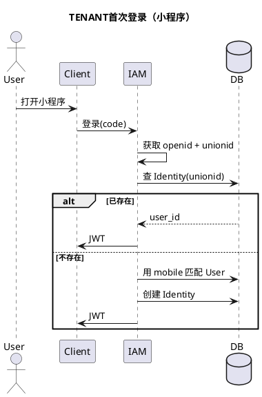
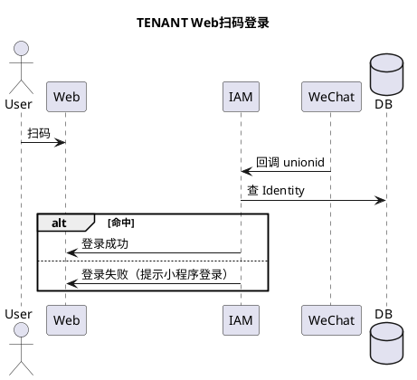
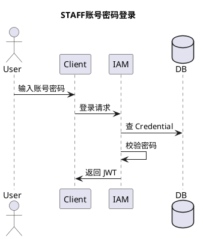
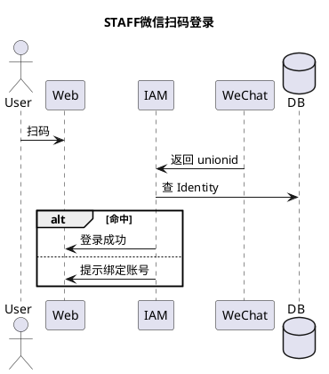
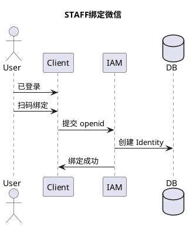
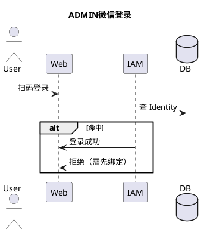

# IAM 模块设计说明（main-service，完整版）

---

# 1. 设计目标

本 IAM 模块用于支撑系统中三类用户的统一认证与身份管理：

* **ADMIN**：系统管理用户（内置 / 人工创建）
* **STAFF**：运营用户（由 Admin 创建）
* **TENANT**：租客用户（业务自动创建，纯微信体系）

目标：

```text
1. 统一认证模型（Identity 驱动）
2. 支持多登录方式（微信 / 密码 / 小程序）
3. 支持多应用（Web / 小程序）
4. 对不同用户类型实施差异化策略
```

---

# 2. 核心设计原则

```text
1. User 是业务主体（唯一）
2. Identity 是登录入口（可多个）
3. Credential 仅用于密码体系
4. 外部身份（微信）必须映射为本地用户
5. 登录 ≠ 绑定（绑定是后置行为）
6. 不同用户类型必须隔离策略
```

---

# 3. 用户模型设计

---

## 3.1 用户类型定义

```text
ADMIN   ：系统管理用户（无业务权限）
STAFF   ：运营用户（门店/区域/管家）
TENANT  ：租客用户（企业员工）
SYSTEM  ：系统内置用户（全业务权限）
```

---

## 3.2 用户能力矩阵

| 用户类型   | 用户名密码 | 微信扫码(Web) | 小程序登录 | 自动注册 |
|--------|-------|-----------|-------|------|
| ADMIN  | ✅     | ✅（需绑定）    | ❌     | ❌    |
| STAFF  | ✅     | ✅         | ✅     | ❌    |
| TENANT | ❌（默认） | ✅（限制）     | ✅（主）  | ✅    |
| SYSTEM | ❌     | ❌         | ❌     | ❌    |

---

# 4. 核心数据模型

---

## 4.1 User 表

```sql
CREATE TABLE user (
    id BIGINT PRIMARY KEY,
    type VARCHAR(20) NOT NULL, -- ADMIN / STAFF / TENANT / SYSTEM
    status VARCHAR(20) NOT NULL,
    mobile VARCHAR(20),
    source VARCHAR(20), -- MANUAL / AUTO
    created_at TIMESTAMP,
    updated_at TIMESTAMP
);
```

---

## 4.2 Identity 表（核心）

```sql
CREATE TABLE identity (
    id BIGINT PRIMARY KEY,
    user_id BIGINT NOT NULL,
    provider VARCHAR(20) NOT NULL, -- wechat / password
    provider_user_id VARCHAR(100) NOT NULL, -- openid / username
    union_id VARCHAR(100),
    app_id VARCHAR(100),
    created_at TIMESTAMP,

    UNIQUE(provider, provider_user_id),
    UNIQUE(provider, union_id)
);
```

---

## 4.3 Credential 表（仅密码登录）

```sql
CREATE TABLE credential (
    user_id BIGINT PRIMARY KEY,
    username VARCHAR(100),
    password_hash VARCHAR(255),
    created_at TIMESTAMP
);
```

---

# 5. 登录流程设计（统一入口）

---

## 5.1 登录核心流程

```text
1. 确定 provider（wechat / password）
2. 获取 externalId（openid / unionid / username）
3. 查 Identity
4. 找到 User
5. 校验用户类型 & 登录方式
6. 返回 JWT
```

---

---

# 6. TENANT 用户设计（纯微信体系）

---

## 6.1 场景：首次登录（小程序）



---

## 6.2 场景：再次登录

```text
unionid → Identity → User → 登录
```

---

## 6.3 场景：Web扫码登录



---

## 6.4 TENANT 关键策略

```text
1. 不使用账号密码
2. 强依赖 unionid
3. 首次通过手机号匹配绑定
4. Web 不允许自动注册
```

---

# 7. STAFF 用户设计

---

## 7.1 场景：账号密码登录



---

## 7.2 场景：微信扫码登录



---

## 7.3 场景：绑定微信



---

## 7.4 STAFF 策略

```text
1. 必须由 Admin 创建
2. 不允许自动注册
3. 支持多登录方式
4. 微信必须绑定后才能登录
```

---

# 8. ADMIN 用户设计

---

## 8.1 场景：账号密码登录

（同 STAFF）

---

## 8.2 场景：微信登录（需绑定）



---

## 8.3 ADMIN 策略

```text
1. 不允许自动注册
2. 微信仅作为辅助登录
3. 必须先登录再绑定
4. 安全优先
```

---

# 9. 目录结构设计

```text
iam/
├── controller/
│   ├── AuthController.java
│
├── application/
│   ├── AuthApplicationService.java
│   ├── WechatLoginService.java
│   ├── PasswordLoginService.java
│
├── domain/
│   ├── model/
│   │   ├── User.java
│   │   ├── Identity.java
│   │   ├── Credential.java
│   │
│   ├── service/
│   │   ├── IdentityDomainService.java
│
├── infrastructure/
│   ├── repository/
│   │   ├── UserRepository.java
│   │   ├── IdentityRepository.java
│   │   ├── CredentialRepository.java
│
│   ├── external/
│   │   ├── WechatClient.java
│
├── api/
│   ├── dto/
│   │   ├── LoginRequest.java
│   │   ├── LoginResponse.java
```

---

# 10. 核心业务逻辑（统一伪代码）

```java
loginByWeChat(code, appId):

1. 获取 openid, unionid

2. 查 unionid
   if exists → return

3. 查 openid
   if exists → return

4. if TENANT:
       mobile 匹配 → 绑定
       or 创建用户
       return

5. if STAFF / ADMIN:
       return 需要绑定
```

---

# 11. 安全与约束

```text
1. unionid 必须唯一
2. Identity 不允许跨用户类型
3. 不同 app_id 必须区分
4. 登录必须校验用户类型权限
```

---

# 12. 实现步骤拆分（重点）

---

## 阶段1：基础模型

```text
- 建立 User / Identity / Credential 表
- 实现 Repository
- 完成基础 Domain Model
```

---

## 阶段2：登录基础能力

```text
- 实现密码登录（STAFF / ADMIN）
- 实现微信登录（获取 openid / unionid）
- 实现 JWT 生成
```

---

## 阶段3：TENANT 登录闭环

```text
- 小程序登录流程
- unionid 匹配
- mobile 自动绑定
- 自动注册（可选）
```

---

## 阶段4：STAFF / ADMIN 绑定体系

```text
- 登录后绑定微信
- 扫码绑定流程
- Identity 建立
```

---

## 阶段5：多端支持

```text
- Web扫码登录
- 小程序登录
- app_id 区分
```

---

## 阶段6（进阶，强烈建议）

```text
- Account Merge（账号合并）
- 多小程序 unionid 打通
- 风控（异常登录检测）
```

---

# 13. 总结

```text
本系统 IAM 的核心是：

User = 主体
Identity = 登录入口
Wechat = 外部身份

TENANT → 纯微信体系（无账号密码）
STAFF / ADMIN → 混合体系（可控安全）

通过 unionid 实现跨应用统一身份
通过 Identity 实现登录方式解耦
```
